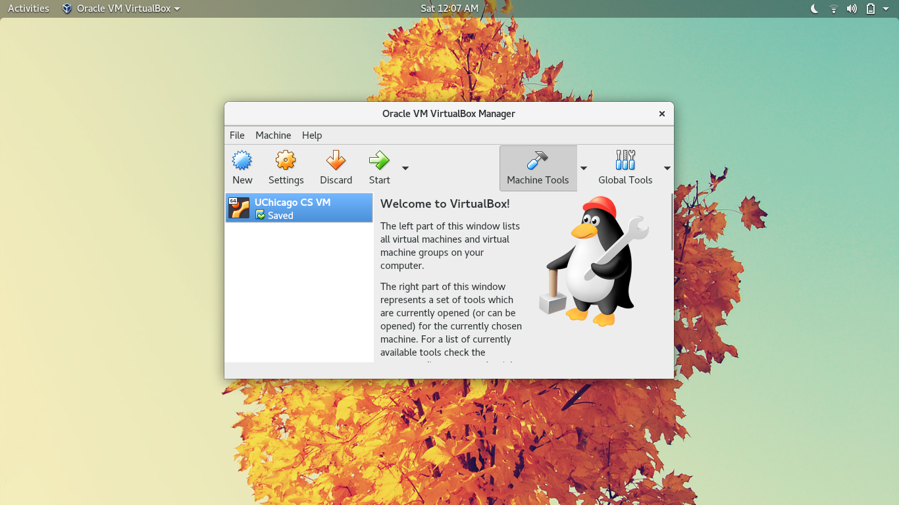
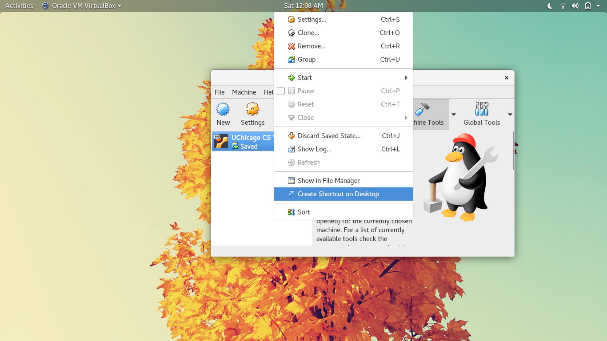
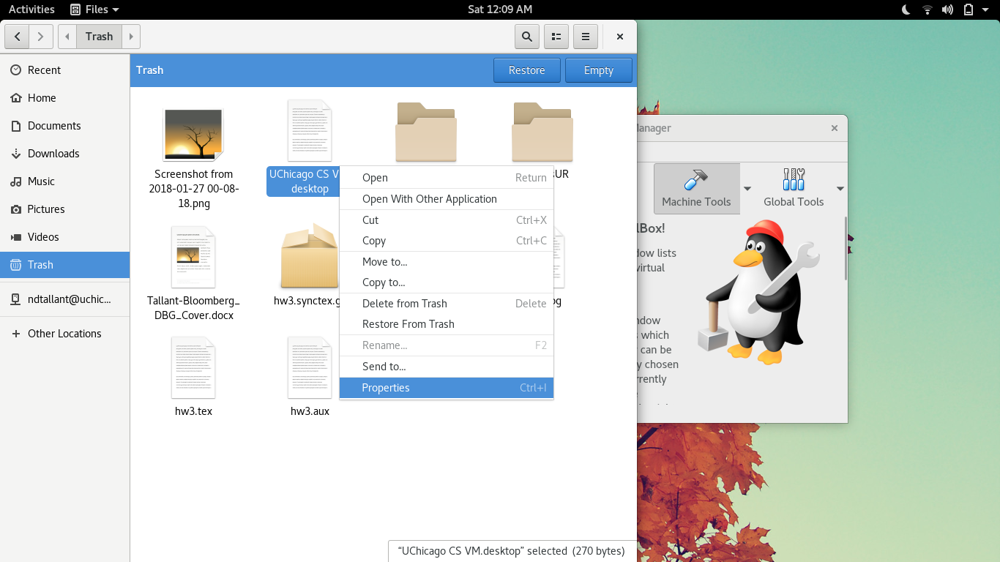
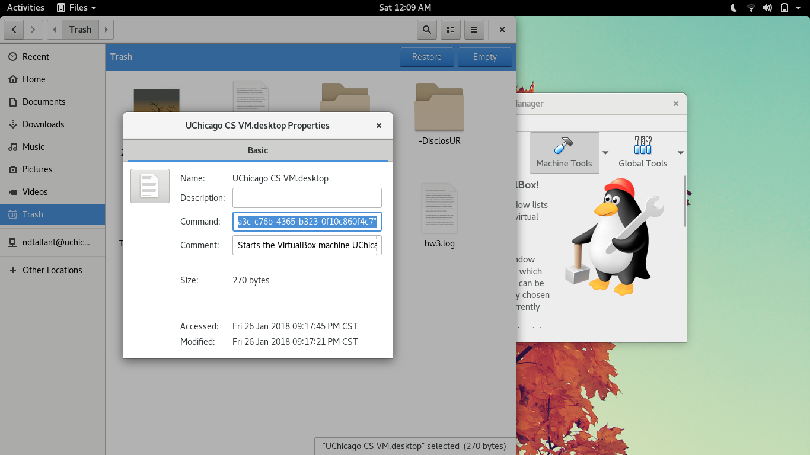
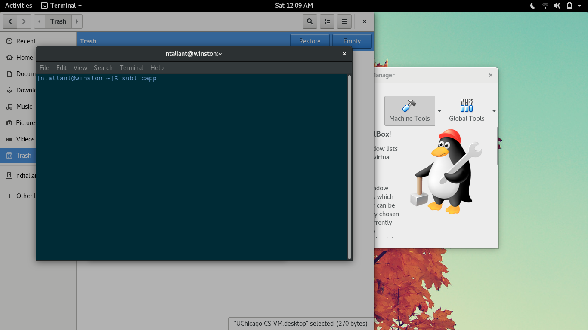
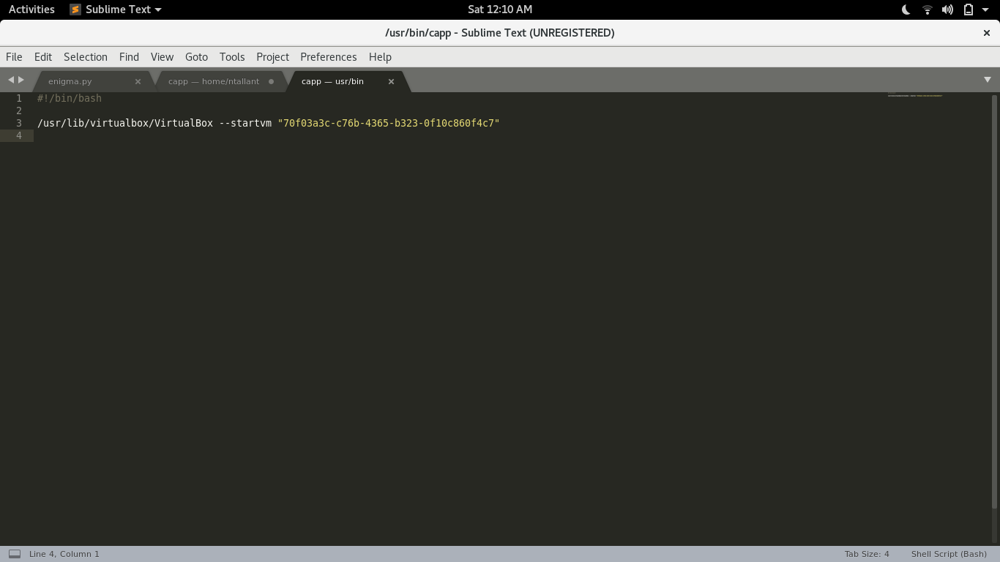
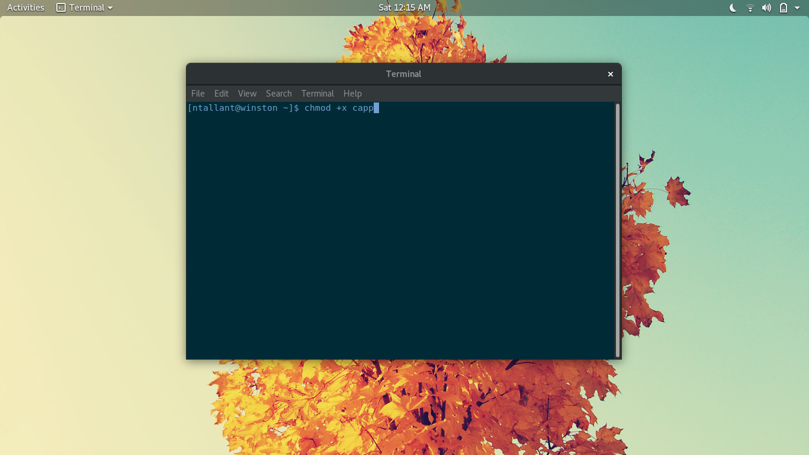
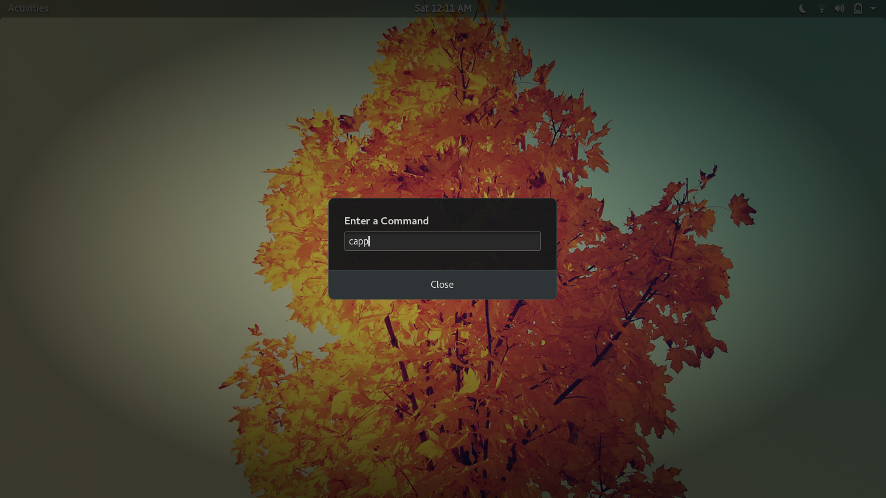
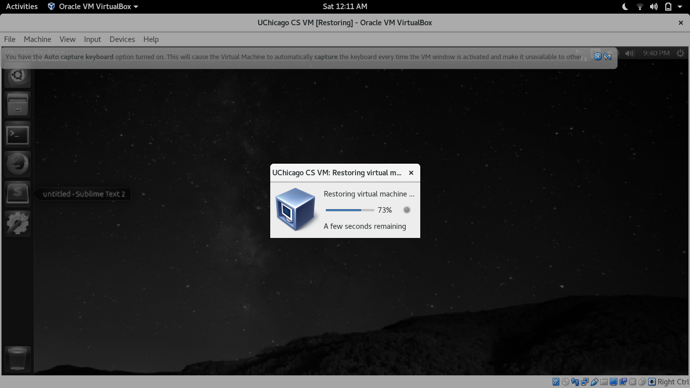

# Self Study

This repo is full of half finished thoughts and scratch notes.

## Opening a specific VirtualBox VM through terminal.

1. Go to the VM you want to open, right-click, and "create desktop shortcut".

2. Go to the shortcut, right-click, and select "properties".

3. Copy the "command" to your clipboard, feel free to delete the shortcut.

4. Open a file in your text editor with the name of your desired command (I used capp).

5. Make the top line of the file "#!/bin/bash", and the other line the copied command.
   The comment is not needed, feel free to delete it!

6. Save the file, and make it executable with "chmod +x *filename*".

7. Move the file to /usr/bin/, you may need root permission. 

8. Now type the name of your command (filename) in terminal, or as an executable. 

9. Enjoy not clicking two buttons to access your VM!

